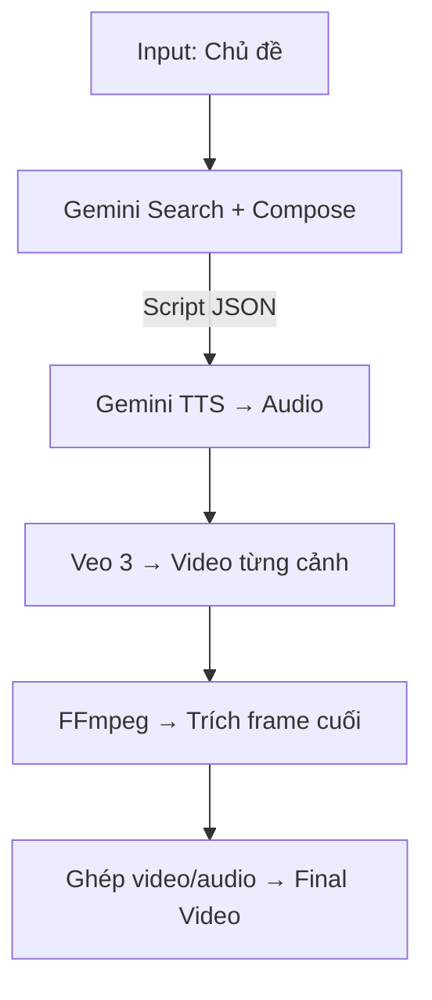

# 🎬 Google AI Video Pipeline

Pipeline này tự động sinh **video tin tức hoặc phóng sự** chỉ bằng các mô hình AI của **Google** (Gemini, Veo, Imagen, TTS).  
Toàn bộ quá trình được điều phối bởi file [`main.py`](./main.py).

---

## 🧠 Tổng quan pipeline

Pipeline gồm **4 giai đoạn chính**, chạy tuần tự:

1. **Sinh kịch bản (script)**
2. **Sinh từng cảnh quay (scenes)**
3. **Ghép video hoàn chỉnh (concat)**
4. **Ghi log và xuất kết quả**

Toàn bộ được triển khai trong `main.py` dưới các hàm:
- `generate_full_script()`
- `generate_scenes()`
- `concat_final()`

---

## ⚙️ Chi tiết từng giai đoạn

### 🩵 1. Giai đoạn `script` — Tạo kịch bản từ chủ đề

**Hàm:** `generate_full_script(topic, api_key, out_path, skip_search=False)`

#### Quy trình:
1. Đọc prompt trong `prompts/search_prompt.txt`
2. Gọi Gemini (`generate_text`) để **tìm kiếm thông tin thật trên web**
3. Ghi kết quả vào `outputs/scripts/search_context.txt`
4. Dựa trên kết quả đó, đọc prompt `prompts/compose_prompt.txt`
5. Sinh **JSON kịch bản** (thường gồm 10 cảnh) và lưu vào:
```

outputs/scripts/script.json

````

#### Đầu ra:
```json
[
{
 "scene_id": 1,
 "ssml": "<speak>...</speak>",
 "visual_desc": "MC đứng tại trường quay...",
 "transition_hint": "chuyển sang cảnh ngoài trời..."
},
...
]
````

---

### 🟦 2. Giai đoạn `scenes` — Sinh video cho từng cảnh

**Hàm:** `generate_scenes(api_key, out_dir, script_path)`

#### Quy trình từng cảnh:

1. Đọc `ssml` và sinh audio bằng **Gemini TTS** (`tts_speech`)
2. Sinh video bằng **Veo 3**:

   * Dựa trên `visual_desc` và `transition_hint`
   * Nếu có cảnh trước → truyền khung hình cuối (`image_ref`) để giữ continuity
3. Trích khung hình cuối bằng `ffmpeg` để dùng cho cảnh kế tiếp

#### Thư mục output:

```
outputs/
 ├── audio/scene_01.mp3
 ├── video/scene_01.mp4
 ├── frames/scene_01_last.png
 └── scripts/script.json
```

---

### 🟨 3. Giai đoạn `concat` — Ghép video và âm thanh

**Hàm:** `concat_final(out_dir)`

#### Quy trình:

* Ghép các cảnh `.mp4` theo thứ tự (`scene_01.mp4`, `scene_02.mp4`, …)
* Ghép các file `.mp3` tương ứng
* Dùng `ffmpeg` để đồng bộ video–audio và rút gọn độ dài video cuối

#### Đầu ra:

```
outputs/final_video.mp4
```

---

## 🧩 Kiến trúc và các module phụ

### File `utils.py`

Chứa các lớp và hàm hỗ trợ:

| Thành phần        | Chức năng chính                                      |
| ----------------- | ---------------------------------------------------- |
| `generate_text()` | Gọi Gemini (văn bản) qua endpoint `api.thucchien.ai` |
| `tts_speech()`    | Gọi Gemini TTS (Zephyr/Kore) để tạo giọng đọc        |
| `VeoClient`       | Gửi job đến Veo, theo dõi tiến trình, tải video về   |
| `concat_videos()` | Ghép video + audio bằng `ffmpeg`                     |

### Sơ đồ luồng pipeline



---

## 🚀 Cách chạy

```bash
python main.py --topic "Đại lễ kỷ niệm 80 năm Quốc khánh Việt Nam" --stage all
```

### Các chế độ chạy riêng:

| Lệnh             | Chức năng                |
| ---------------- | ------------------------ |
| `--stage script` | Chỉ tạo kịch bản         |
| `--stage scenes` | Sinh video cho từng cảnh |
| `--stage concat` | Ghép các cảnh đã sinh    |
| `--stage all`    | Chạy toàn bộ pipeline    |

---

## 📁 Cấu trúc thư mục

```
.
├── main.py
├── utils.py
├── prompts/
│   ├── search_prompt.txt
│   ├── compose_prompt.txt
│   └── scene_prompt.txt
├── outputs/
│   ├── audio/
│   ├── video/
│   ├── frames/
│   └── scripts/
├── env.json
└── pipeline_log.txt
```

---

## 🔐 Cấu hình API

File `env.json`:

```json
{
  "GOOGLE_API_KEY": "YOUR_API_KEY"
}
```

Mọi request đều gọi qua gateway:

```
https://api.thucchien.ai/
```

---

## 🧾 Log & Debug

* Log toàn bộ pipeline: `pipeline_log.txt`
* Ghi lại tiến trình từng cảnh, lỗi API hoặc timeout
* Nếu dừng giữa chừng, pipeline sẽ bỏ qua những cảnh đã tồn tại

---

## 📜 Ghi chú

* Chạy bằng Python ≥ 3.9
* Cần cài `ffmpeg` (để trích frame và ghép video)
* Tự động tạo thư mục đầu ra nếu chưa tồn tại

---

### 👤 Tác giả

**Hồ Quốc Thiên Anh (Anh Ho)**
AI Engineer @ FTECH AI
📧 [hoquocthienanh@gmail.com](mailto:hoquocthienanh@gmail.com)
🌐 GitHub: [hqta1110](https://github.com/hqta1110)